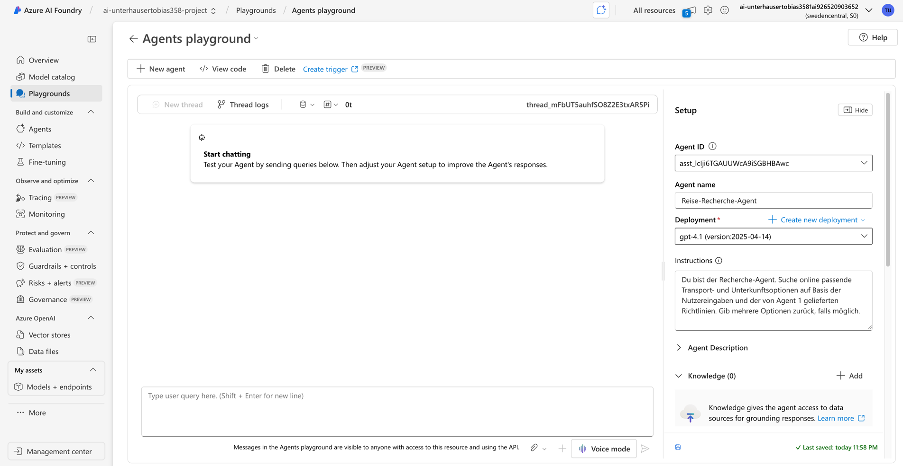
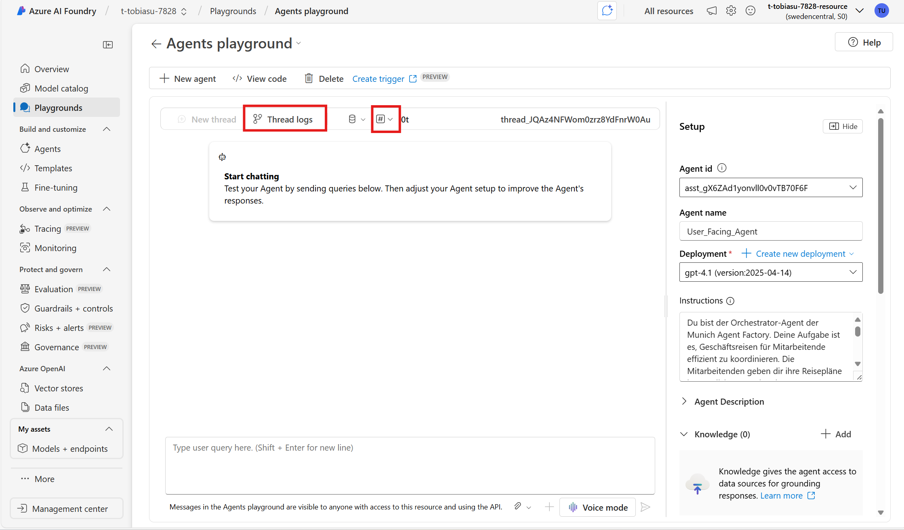
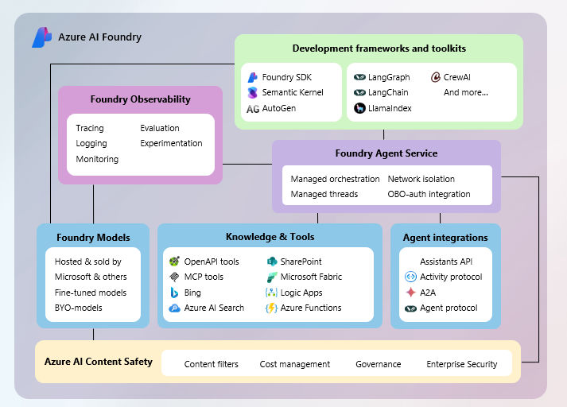

# Boilerplate Setup: AI Foundry & SDK

In this exercise, you use the Azure AI Agent service in the Azure AI Foundry portal to create a simple agentic workflow.


## What are we building ? 🚀

At the **Munich Agent Factory GmbH**, the majority of employees needs to travel for work at least every other week, often also to different countries across Europe. Right now, booking these trips is complicated. Employees have to check different company internal travel policies for each city or country, to figure out how much they can spend on hotels and transport, and make sure they follow all the company policies. This takes a lot of time and prone to error.

**You are an AI Engineer** at the Munich Agent Factory and you want to simplify this process by building an Agentic Application that books business trips for all employees of your company. Key Aspects are:

- Quickly look up the latest travel rules for any destination.
- Tell employees how much they can spend on hotels, transport, and other travel needs.
- Suggest travel options that follow company policies.
- Make booking faster and easier, while helping everyone follow the rules.

You came up with a first draft on how this Agentic could look like and want to implement it now in AI Foundry:


# Part I: Create Agents using the Foundry UI

### Let's start hacking!

First we build the **Travel Research Agent** in the **Foundry Portal via the UI**, following from that we implement the **remaining Agents using the SDK**.

## Create an Azure AI Foundry project and agent

Let's start by creating an Azure AI Foundry project.

1. In a web browser, open the [Azure AI Foundry portal](https://ai.azure.com) at `https://ai.azure.com` and sign in using your Azure credentials. Close any tips or quick start panes that are opened the first time you sign in, and if necessary use the **Azure AI Foundry** logo at the top left to navigate to the home page, which looks similar to the following image (close the **Help** pane if it's open):

    

1. In the home page, select **Create an agent**.
1. When prompted to create a project, enter a valid name for your project.
1. Expand **Advanced options** and specify the following settings:
    - **Azure AI Foundry resource**: *A valid name for your Azure AI Foundry resource*
    - **Subscription**: *Your Azure subscription*
    - **Resource group**: *Select your resource group, or create a new one(e.g. Sweden Central)*
    - **Region**: *Select any **AI Services supported location***\*

    > \* Some Azure AI resources are constrained by regional model quotas. In the event of a quota limit being exceeded later in the exercise, there's a possibility you may need to create another resource in a different region.

1. Select **Create** and wait for your project to be created.
1. When your project is created, the Agents playground will be opened automatically so you can select or deploy a model:

    

    >**Note**: A GPT-4o base model is automatically deployed when creating your Agent and project.

1. Deploy a GPT-4.1 model 

You'll see that an agent with a default name has been created for you, along with your base model deployment.

## Create your Travel Research agent

Now that you have a model deployed, you're ready to build the first AI agent. In this exercise, you'll build a simple agent that answers questions based on a corporate expenses policy. You'll download the expenses policy document, and use it as *grounding* data for the agent.

1. Go to the Azure Portal and create a **Grounding with Bing Search** (https://ms.portal.azure.com/#create/Microsoft.BingGroundingSearch) resource, ideally in the same resource group as the Foundry Project is located
1. Return to the browser tab containing the Foundry Portal and go on the Agents Tab.
1. Click on create new Agent and set the **Agent name** to `Reise-Recherche-Agent`, ensure that the gpt-4.1 model deployment you created previously is selected, and set the **Instructions** to:

    ```prompt
   Du bist der Recherche-Agent. Suche online passende Transport- und Unterkunftsoptionen auf Basis der Nutzereingaben und der von Agent 1 gelieferten Richtlinien. Gib mehrere Optionen zurück, falls möglich.
    ```

    

1. Further down in the **Setup** pane, next to the **Knowledge** header, select **+ Add**. Then in the **Add knowledge** dialog box, select **Grounding with Bing Search**.
1. In the **Choosing an existing Grounding with Bing Search connection** dialog box, select the **Grounding with Bing Search** resource you created earlier and click on connect.

    Your agent can now accesss the internet to seearch for up do tate availability of hotels, flight and train connections.

## Test your agent

Now that you've created an agent, you can test it in the playground chat.

1. In the playground chat entry, enter the prompt: `Reise von München nach Hamburg nächste Woche von Montag bis Freitag` and review the agent's response - which should be based on information in the expenses policy document you added as knowledge to the agent setup.

    > **Note**: If the agent fails to respond because the rate limit is exceeded. Wait a few seconds and try again. If there is insufficient quota available in your subscription, the model may not be able to respond. If the problem persists, try to increase the quota for your model on the **Models + endpoints** page.


# Part II: Create Agents and Orchestrate them using the Foundry SDK

## Setup the local environment

1. Clone this repository to your local machine using your IDE VSC Integration idealy VS Code ;) or directly via the command line:
    ```
   git clone https://github.com/tobiasunterhauser/ai-foundry-agents-workshop
    ```
1. Login into your azure subscription that was used to create your Foundry Project using the following command.
    ```
   az login
    ```

1. (Optional) If the previous command doesn't work this means that the azure cli is not yet installed on your local 
   machine. Install it following the official Documentation and repeat the previous step: https://learn.microsoft.com/en-us/cli/azure/install-azure-cli?view=azure-cli-latest

1. Open a terminal in the project root and go into the right directory for this session

   ```
    cd Hands-On-Hacking-Session-1 
    ```

1. Setup a virtual python environment:
    ```
    (Windows)
   python -m venv labenv
   ./labenv/Scripts/Activate.ps1

    (Mac)
    python3 -m venv labenv
    source labenv/bin/activate
    ```
1. Install necassary packages int othe virtual environment:

    ```
    pip install -r requirements.txt azure-ai-projects

    ````

1. Open the .env file and  replace the **your_project_endpoint** placeholder with the endpoint for your project (copied from the project **Overview** page in the Azure AI Foundry portal), and the **your_model_deployment** placeholder with the name you assigned to your gpt-4o model deployment (found in the **Models + endpoints** in the AI Foundry portal).

1. After you've replaced the placeholders, use the **CTRL+S** command to save your changes and then use the **CTRL+Q** command to close the code editor while keeping the cloud shell command line open.

**You are now ready to go!**


## Start Coding 🧑‍💻

Now you're ready to create the agents for your multi-agent solution! Let's get started!

1. Open the **code.py** file

1. Review the code in the file, noting that it contains strings for each agent name and instructions.

1. Find the comment **Add references** and add the following code to import the classes you'll need:

    ```python
    from azure.ai.agents import AgentsClient
    from azure.ai.agents.models import ConnectedAgentTool, MessageRole, ListSortOrder, FileSearchTool, FilePurpose
    from azure.identity import DefaultAzureCredential
    ```

1. Find the comment Create the agents client and add the following code to instantiate the AgentsClient object:
    ```python
   agents_client = AgentsClient(endpoint=project_endpoint, credential=DefaultAzureCredential())
    ```

1. Locate the comment **Reference the existing Bing Grounding Agent** and substitute the Recherche_Agent_ID with the actual id of your bing grounding agent you created earlier. You can find the id in the Foundry Portal:


1. Locate the comment **Create the Booking Agent**. Look at the docu and think about how you can create the booking Agent, than add the following code:
    
    ```python
    buchungs_agent = agents_client.create_agent(
        model=model_deployment,
        name=buchungs_agent_name,
        instructions=buchungs_agent_instructions
    )
    ```

1. Take a look at the **Reiserichtline_Munich_Agent_Factory_GmbH_v1.pdf** located in the Resources folder. We want to upload this file to a vector store to make it available for our agent as a knowledge source.

1. Locate the comment **Upload the travel policy file to foundry and create a vector store** and add the following code:
     ```python
    file = agents_client.files.upload_and_poll(file_path=policy_file_path, purpose=FilePurpose.AGENTS)
    vector_store = agents_client.vector_stores.create_and_poll(file_ids=[file.id], name="travel_policy_vector_store")
    ```


1. Locate the comment **Create file search tool with resources followed by creating agent** and add the following code:

     ```python
    file_search = FileSearchTool(vector_store_ids=[vector_store.id])
    ```

1. Locate the comment **Create the policy agent using the file search tool**, create the policy_agent by looking on how the buchungs_agent was created. Hint: You need to add addionally the following for the file search tool calling when calling the create_agent method: 
     ```python
    tools=file_search.definitions,
    tool_resources=file_search.resources,

    ```
1. Locate the comment **Create the connected agent tools for all 3 agents**. Observe how the policy_agent_tool was created and create the same for the rechereche_agent_tool and buchungs_agent_tool.

1. Locate the comment **Create the Orchestrator Agent** and add the following code:

     
     ```python
    orchestrator_agent = agents_client.create_agent(
    model=model_deployment,
    name=orchestration_agent_name,
    instructions=orchestration_instructions,
    tools=[
        policy_agent_tool.definitions[0],
        recherche_agent_tool.definitions[0],
        buchungs_agent_tool.definitions[0]
    ]
    )
    ```
1. Use the **CTRL+S** command to save your changes to the code file.

1. Run the code by entering the following command in the terminal: 
    
    ```
   python code.py
    ```
## Observe the created Agents in AI Foundry

While your code is running, you can observe the agent orchestration in the AI Foundry UI:

- Go to the **Agents** tab in AI Foundry.
- Locate and click on the `orchestrator_agent`. You will see that three sub-agents have been added as Connected Agents.
- As the script runs, these agents are active. When you type `exit` in the terminal, all agents except the `recherche_agent` are automatically deleted.

**Tip:**  
Try using the `orchestrator_agent` directly in the AI Foundry playground. After a successful run, open the **Thread Logs** to inspect how the orchestrator called each connected agent.

Additionally, next to the Thread Logs, you can click on the `#` icon to select and display different evaluation metrics for the agent



# Next Step: Your Turn!

Now it's your turn check out the full documentation on Tools and Knowledge you can connect to Agents and get started with the MVP of your idea.

