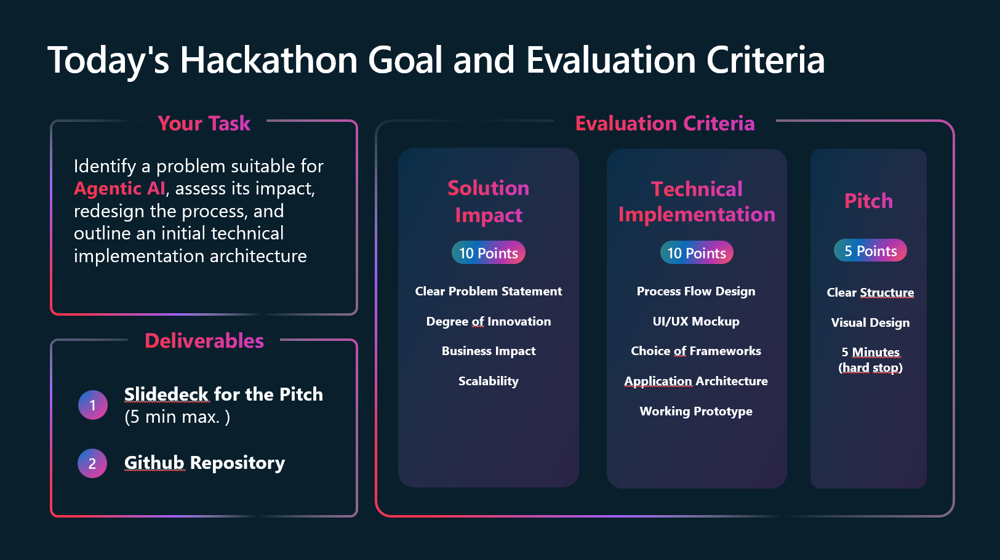

# 🤖 Microsoft Agent Hackathon for Students

This repository contains all materials necessary for the Microsoft Student Hackathon taking place at the Munich Headquarter on July 15th 2025. 🚀

## 📅 Agenda

| **Time** | **Session** | **Material / Slides** |
|:---------|:-----------|:---------------------|
| 09:00 - 09:10 | **Welcome**| [Open Slides]() |
| 09:10 - 09:30 | **Introduction to Agentic Systems** Concept of single and multi Agent Systems including Business Use Cases | [Open Slides]() |
| 09:30 - 09:50 | **How to build Agentic Systems** Guide on how to develope Agentic Systems with the Microsoft Stack | [Hack Session 1]() |
| 09:50 - 10:00 | **Hackathon Challange and Guidelines**  Presenation of Hackathon Challang and Evaluation Criteria | [Hack Session 1]() |
| 10:00 - 13:00 | **Hacking Session 1** | [Open Slides]() |
| 10:00 - 13:00 | Lunch Break |  |
| 14:00 - 16:00 | **Hacking Session 2** | [Open Slides]() |
| 16:00 - 17:15 | **Team Pitch and Winner Announcements** | [Open Slides]() |
| 17:15 - 17:45 | **Careers at Microsoft** | [Open Slides]() |
| 17:45 - 18:00 | **Closing remarks & Netowrking** | [Open Slides]() |

## 🏆 Evaluation Criteria

## 🚀 Getting Started

### 1.  Setting up your Subscription and Azure AI Foundry ☁️

We provide every team with 50 $ in Azure Credits to setup an AI Foundry Instance. We will come to every team individualy to set this up. For further credits you can leverage also the free credits given to students. [Request free student azure credits here](https://azure.microsoft.com/en-us/free/students#:~:text=Start%20free%20with%20%24100%20credit%20to%20use%20in,get%20%24100%20credit%20and%20free%20services%E2%80%94just%20like%20before.?msockid=1dbbfc39330560290369e9af326e61ff)

### 2. Continue with the starter Code for Azure AI Foundry SDK [AI Foundry SDK](./AI-Foundry-SDK/) 

This is a short guide to explain how Agents are created in Azure AI Foundry. It contains an exercise you can follow to have a working local setup of the Azure AI Agents SDK

### 3. (Optional) ontinue with the starter Code for the Semantic Kernel SDK [Semantic Kernel](./Semantic-Kernel-SDK/)

Only necessary if you decide to use Semantic Kernel as an orchestration Framework

### 4. Checkout the official Microsoft documentation and additional resources 📚

- **Azure AI Foundry Agent Service** - [Microsoft Documentation](https://learn.microsoft.com/en-us/azure/ai-foundry/agents/overview)

- **Semantic Kernel Agent Framework** - [Microsoft Documentation](https://learn.microsoft.com/en-us/semantic-kernel/frameworks/agent/?pivots=programming-language-python)

- **Azure AI Templates** - [Browse Templates](https://azure.github.io/ai-app-templates/)

- **LangGraph** - [Official Documentation](https://www.langchain.com/langgraph)

## 🎥 Demo

You can access the repository of the shown live demo of the multi-agent system here: https://aka.ms/demo-multi-agent
